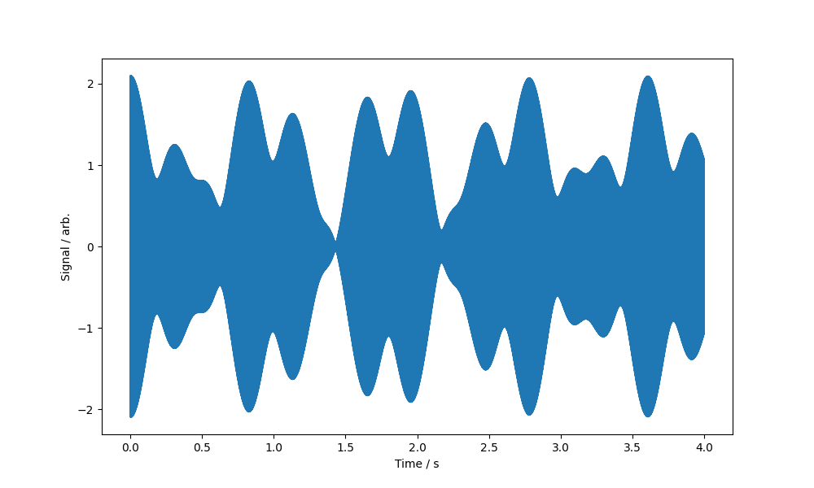
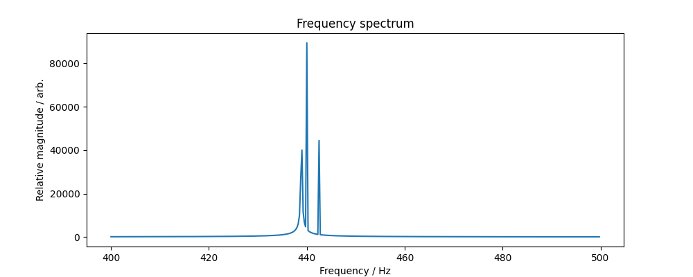

# Exercise 3: deconvoluting sine waves using Fourier transforms
The file `audio.csv` contains 4 seconds of an audio signal sampled at 44.1 kHz. It has the following structure:
```txt
# Time [s], Signal [arb.]
0.000000000000000000e+00,0.000000000000000000e+00
2.267573696145124763e-05,1.316453739555655533e-01
4.535147392290249526e-05,2.627728820013497391e-01
6.802721088435373950e-05,3.928666954799496236e-01
```
The first column is the time in seconds; the second column is the signal amplitude in arbitrary units. The waveform is comprised of three sine waves with different frequencies and amplitudes. The resulant wave is shown below.



Your task is to Fourier transform the data to determine the frequencies of the three sine waves that make up the signal. You may wish to plot the transformed signal amplitude as a function of frequency as well to visualise the three peaks. You can estimate their relative amplitudes from this.

As a fun bonus, you can run the code in [`create_wav.py`](create_wav.py) to create a `.wav` file that can be opened by most media players, allowing you to listen to the audio signal. **Warning: if wearing headphones, turn down your volume first -- it sounds awful!**

If you're not sure where to start, click on the hints below.

<details>
  <summary>Hint #1 (click me)</summary>
  
  NumPy's FFT function (see [`numpy.fft.ftt`](https://numpy.org/doc/stable/reference/generated/numpy.fft.fft.html)) can be used to transform the data. It's used as follows:

  ```python
  # Perform the FFT
  fft_result = np.fft.fft(signal)
  fft_magnitude = np.abs(fft_result)
  fft_freq = np.fft.fftfreq(len(signal), d=(t[1] - t[0]))

  # Only take the positive frequencies
  freqs = fft_freq[:len(fft_freq)//2]
  magnitudes = fft_magnitude[:len(fft_magnitude)//2]
  ```
  
</details>

<details>
  <summary>Hint #2 (click me)</summary>
  
  To systematically find peaks in data (rather than squinting at your screen), you can use SciPy's peak-finder (see [`scipy.signal.find_peaks`](https://docs.scipy.org/doc/scipy/reference/generated/scipy.signal.find_peaks.html)). It's used as follows:

  ```python
  # Find peaks in the magnitudes
  peaks, _ = find_peaks(magnitudes)
  peak_freqs = freqs[peaks]
  print("Frequencies identified from FFT include:")
  for pf in peak_freqs:
      print(f"  {pf} Hz")
  ```
  
</details>

## Correct answers
<details>
  <summary>Click me!</summary>
  
  ```txt
  Frequencies identified from FFT include:
    439.0 Hz
    440.0 Hz
    442.5 Hz
    22049.5 Hz
  ```

  The 22049.5 Hz was mistakenly picked up by SciPy. Why do you think this is? Is this value a coincidence? Is there a way we can filter it out?
  
  
  
</details>
